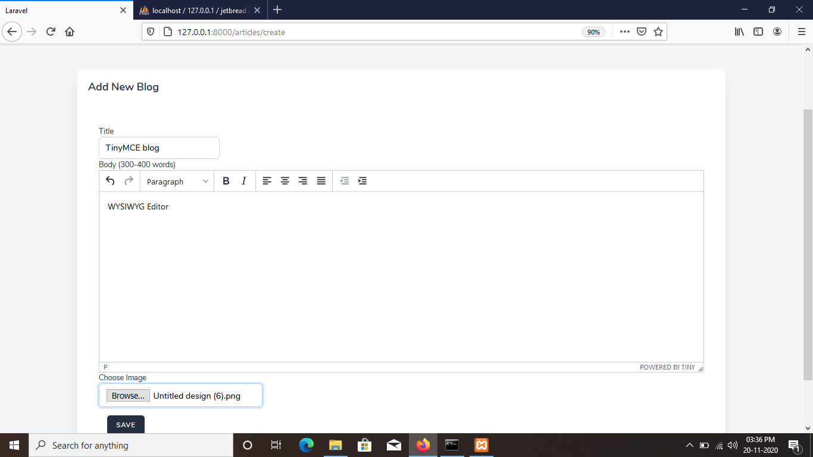

# BlogCMS 
## Laravel Jetstream 8.x

This Project Demonstrate a simple use-case of Laravel.
I have used Laravel Jetstream and its authentication.

### To run this project locally follow below steps
1. Clone this repo/project
2. <code>composer install</code>
3. <code>npm install && npm run dev</code>
4. Copy <code>.env.example</code> paste it into <code>.env</code>
5. Add database credentials in <code>.env</code> file
6. Run server using <code>php artisan serve</code>

## TinyMCE WYSIWYG Editor
I have used TinyMCE for writing blogs with all formatting.
So in order to use it you have to add TinyMCE cdn in blog/create.blade.php and also in blog/edit.blade.php in resources.

## Since this project is not hosted on live server,
## Here are some Screenshots
#### The ADMIN/CRUD link on Header in project is for admin login page.

## User Side/Frontend
### Home Page

### Top Blogs on Home Page

### Blogs Page

### Detailed Blog View-1

### Detailed Blog View-2

## Admin/Back-End

### Admin Login

### Admin Dashboard/Blog List

### Admin Add Blog (WYSIWYG Editor)

### Admin Edit Blog (WYSIWYG Editor)

### Admin View Blog

### Admin Profile

### Admin Logout

